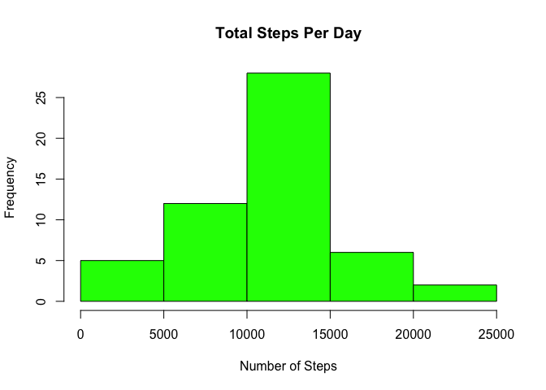
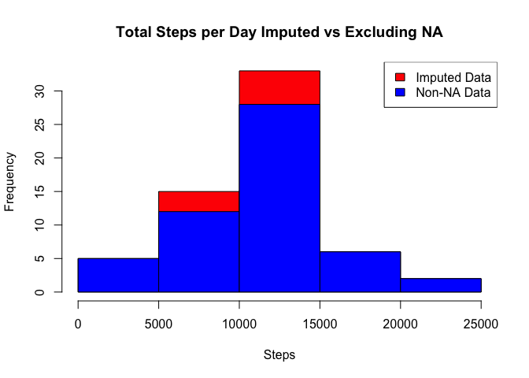
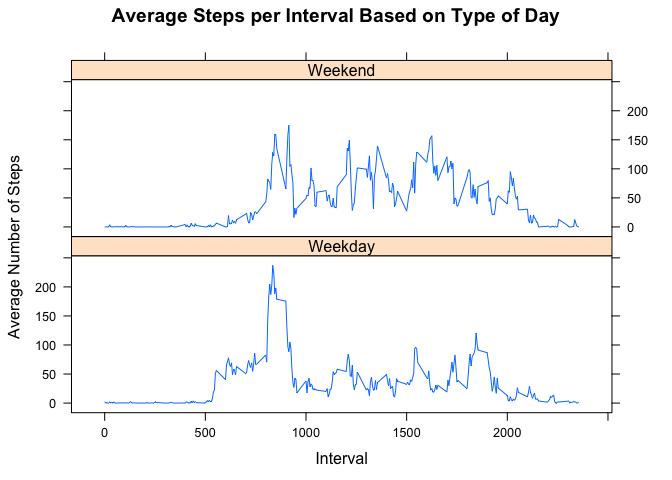

# Reproducible Research : Peer Assessment 1
Vijeta Bhambhani  
August 23, 2017  

# Introduction

It is now possible to collect a large amount of data about personal movement using activity monitoring devices such as a Fitbit, Nike Fuelband, or Jawbone Up. These type of devices are part of the “quantified self” movement – a group of enthusiasts who take measurements about themselves regularly to improve their health, to find patterns in their behavior, or because they are tech geeks. But these data remain under-utilized both because the raw data are hard to obtain and there is a lack of statistical methods and software for processing and interpreting the data.

This assignment makes use of data from a personal activity monitoring device. This device collects data at 5 minute intervals through out the day. The data consists of two months of data from an anonymous individual collected during the months of October and November, 2012 and include the number of steps taken in 5 minute intervals each day.


# Data 

The data for this assignment can be downloaded from the course web site:

Dataset: Activity monitoring data [52K]

The variables included in this dataset are:

steps: Number of steps taking in a 5-minute interval (missing values are coded as 𝙽𝙰)
date: The date on which the measurement was taken in YYYY-MM-DD format
interval: Identifier for the 5-minute interval in which measurement was taken

The dataset is stored in a comma-separated-value (CSV) file and there are a total of 17,568 observations in this dataset.

#Assignment 


## Loading and preprocessing the data

Show any code that is needed to

Load the data (i.e. 𝚛𝚎𝚊𝚍.𝚌𝚜𝚟())


```r
setwd("/Users/Vijeta/Documents/DataScience/Reproducible Research")
library(ggplot2)
```

```
## Warning: package 'ggplot2' was built under R version 3.2.5
```

```r
library(plyr)
```

```
## Warning: package 'plyr' was built under R version 3.2.5
```

```r
activity <- read.csv("activity.csv")
```


Process/transform the data (if necessary) into a format suitable for your analysis


```r
activity$day <- weekdays(as.Date(activity$date))
activity$DateTime<- as.POSIXct(activity$date, format="%Y-%m-%d")

##pulling data without nas
clean <- activity[!is.na(activity$steps),]

names(clean)
```

```
## [1] "steps"    "date"     "interval" "day"      "DateTime"
```

## What is mean total number of steps taken per day?

For this part of the assignment, you can ignore the missing values in the dataset.

Calculate the total number of steps taken per day.


```r
## summarizing total steps per date
steps_by_day <- aggregate(steps ~ date, activity, sum)
```

If you do not understand the difference between a histogram and a barplot, research the difference between them. Make a histogram of the total number of steps taken each day


```r
## Creating the historgram of total steps per day
hist(steps_by_day$steps, main = paste("Total Steps Per Day"), col="green", xlab="Number of Steps")
```

<!-- -->

Calculate and report the mean and median of the total number of steps taken per day


```r
## Mean of Steps
as.integer(mean(steps_by_day$steps))
```

```
## [1] 10766
```


```r
## Median of Steps
as.integer(median(steps_by_day$steps))
```

```
## [1] 10765
```


The average number of steps taken each day was 10,766 steps.

The median number of steps taken each day was 10,765 steps.

## What is the average daily activity pattern?


Make a time series plot (i.e. 𝚝𝚢𝚙𝚎 = "𝚕") of the 5-minute interval (x-axis) and the average number of steps taken, averaged across all days (y-axis)


```r
library(plyr)
library(ggplot2)

##pulling data without nas
clean <- activity[!is.na(activity$steps),]

names(clean)
```

```
## [1] "steps"    "date"     "interval" "day"      "DateTime"
```


```r
##create average number of steps per interval
intervalTable <- ddply(clean, .(interval), summarize, Avg = mean(steps))

##Create line plot of average number of steps per interval
p <- ggplot(intervalTable, aes(x=interval, y=Avg), xlab = "Interval", ylab="Average Number of Steps")
p + geom_line()+xlab("Interval")+ylab("Average Number of Steps")+ggtitle("Average Number of Steps per Interval")
```

<!-- -->


Which 5-minute interval, on average across all the days in the dataset, contains the maximum number of steps?


```r
##Maximum steps by interval
maxSteps <- max(intervalTable$Avg)

maxSteps
```

```
## [1] 206.1698
```


```r
##Which interval contains the maximum average number of steps
intervalTable[intervalTable$Avg==maxSteps,1]
```

```
## [1] 835
```

The maximum number of steps for a 5-minute interval was 206 steps.

The 5-minute interval which had the maximum number of steps was the 835 interval.


## Imputing missing values

Note that there are a number of days/intervals where there are missing values (coded as 𝙽𝙰). The presence of missing days may introduce bias into some calculations or summaries of the data.

Calculate and report the total number of missing values in the dataset (i.e. the total number of rows with 𝙽𝙰.)


```r
##Number of NAs in dataset
nrow(activity[is.na(activity$steps),])
```

```
## [1] 2304
```


The total number of rows with steps = ‘NA’ is 2304.


Devise a strategy for filling in all of the missing values in the dataset. The strategy does not need to be sophisticated. For example, you could use the mean/median for that day, or the mean for that 5-minute interval, etc.

My strategy for filling in NAs will be to substitute the NA with average 5-minute interval based on the day of the week.


```r
## Create the average number of steps per weekday and interval
avgTable <- ddply(clean, .(interval, day), summarize, Avg = mean(steps))

## Create dataset with all NAs for substitution
nadata<- activity[is.na(activity$steps),]
## Merge NA data with average weekday interval for substitution
newdata<-merge(nadata, avgTable, by=c("interval", "day"))
```


Create a new dataset that is equal to the original dataset but with the missing data filled in.


```r
## Create dataset with substitution from imputation
dataimpute<- activity[is.na(activity$steps),]
## Merge NA data with average weekday interval for substitution
newdata<-merge(dataimpute, avgTable, by=c("interval", "day"))

## Reorder the new  data in the same format as clean data set
newdata2<- newdata[,c(6,4,1,2,5)]
colnames(newdata2)<- c("steps", "date", "interval", "day", "DateTime")

##Merge the NA averages and non NA data together
mergeData <- rbind(clean, newdata2)
```

Make a histogram of the total number of steps taken each day and Calculate and report the mean and median total number of steps taken per day.


```r
##Create sum of steps per date to compare with step 1
sumTable2 <- aggregate(steps ~ date, mergeData,sum)
colnames(sumTable2)<- c("Date", "Steps")
```


```r
## Mean of Steps with NA data taken care of
as.integer(mean(sumTable2$Steps))
```

```
## [1] 10821
```


```r
## Median of Steps with NA data taken care of
as.integer(median(sumTable2$Steps))
```

```
## [1] 11015
```


```r
## Creating the histogram of total steps per day, categorized by data set to show impact
hist(sumTable2$Steps, breaks=5, xlab="Steps", main = "Total Steps per Day Imputed vs Excluding NA", col="red")
hist(steps_by_day$steps, breaks=5, xlab="Steps", main = "Total Steps per Day Imputed vs Excluding NA", col="blue",add=T)

legend("topright", c("Imputed Data", "Non-NA Data"), fill=c("red", "blue") )
```

<!-- -->


Do these values differ from the estimates from the first part of the assignment? What is the impact of imputing missing data on the estimates of the total daily number of steps?

The new mean of the imputed data is 10,821 steps compared to the original mean of 10,766 steps. That equates to a difference of 55 steps on average per day.

The new median of the imputed data is 11,015 steps compared to the original median of 10,765 steps. That creates a difference of 250 steps for the median.

However, the distribution has not changed.


## Are there differences in activity patterns between weekdays and weekends?

For this part the 𝚠𝚎𝚎𝚔𝚍𝚊𝚢𝚜() function may be of some help here. Use the dataset with the filled-in missing values for this part.

Create a new factor variable in the dataset with two levels – “weekday” and “weekend” indicating whether a given date is a weekday or weekend day.


```r
## Create new factor variable in the dataset based on the days of the week
mergeData$DayCategory <- ifelse(mergeData$day %in% c("Saturday", "Sunday"), "Weekend", "Weekday")
```

Make a panel plot containing a time series plot (i.e. 𝚝𝚢𝚙𝚎 = "𝚕") of the 5-minute interval (x-axis) and the average number of steps taken, averaged across all weekday days or weekend days (y-axis). See the README file in the GitHub repository to see an example of what this plot should look like using simulated data.


```r
library(lattice) 
```

```
## Warning: package 'lattice' was built under R version 3.2.5
```

```r
## Summarize data by interval and type of day
intervalTable2 <- ddply(mergeData, .(interval, DayCategory), summarize, Avg = mean(steps))

##Plot data in a panel plot
xyplot(Avg~interval|DayCategory, data=intervalTable2, type="l",  layout = c(1,2),
       main="Average Steps per Interval Based on Type of Day", 
       ylab="Average Number of Steps", xlab="Interval")
```

<!-- -->

Yes, the step activity is different based on whether the day is a weekend or a weekday. This may be due to people having more time and energy to engage in more activity beyond the normal 8-5 working hours during the week.  

